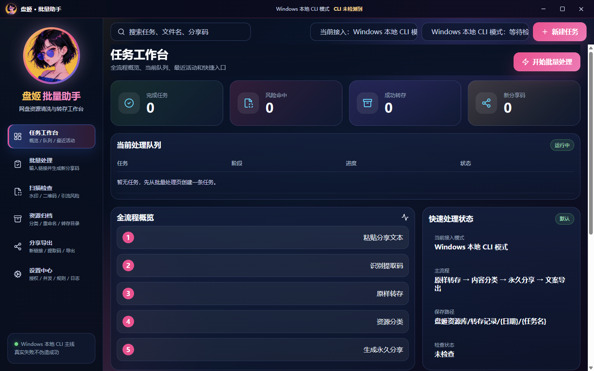
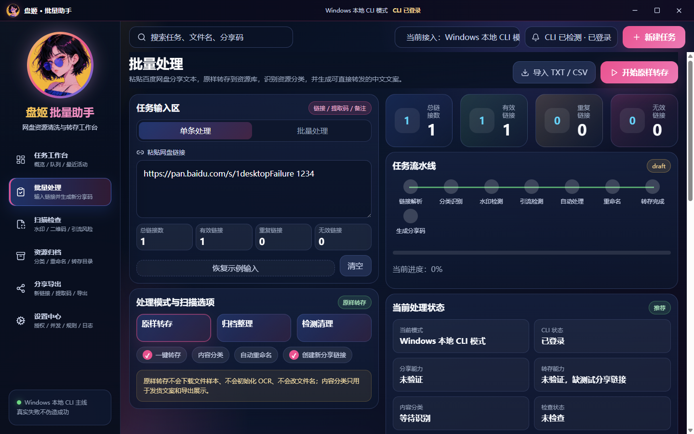
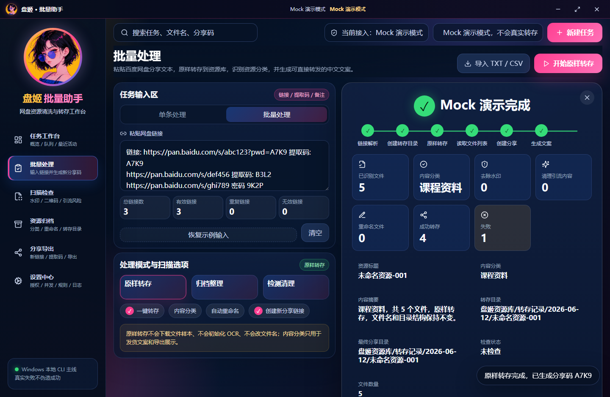
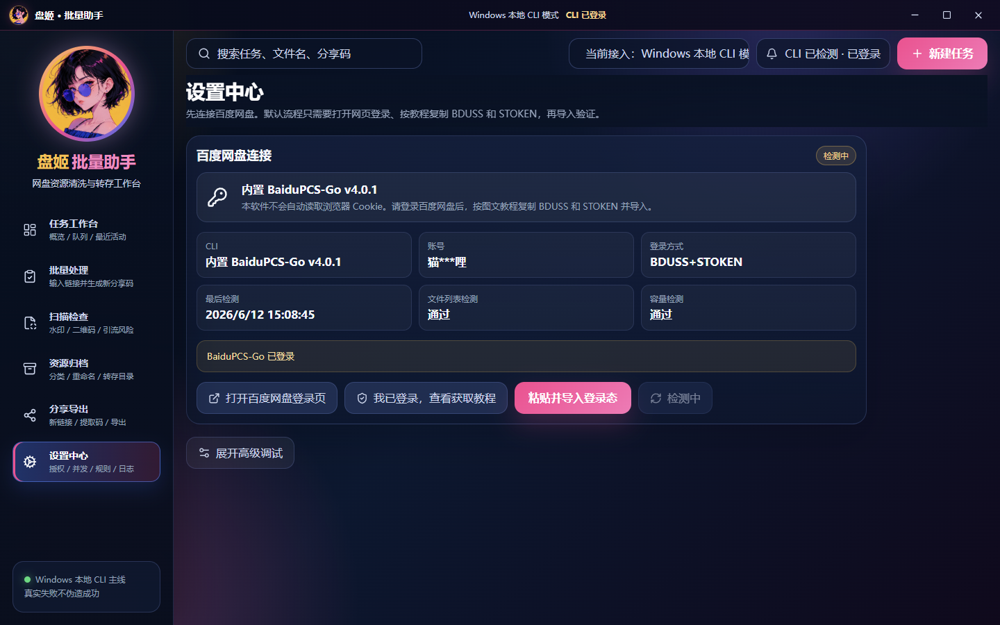

# 盘姬 · 批量助手

一个面向 Windows 的百度网盘资源批量处理桌面客户端。当前 MVP 目标很明确：**粘贴别人发来的百度网盘分享文本，原样转存到自己的网盘资源库，识别这份资源属于什么内容，再生成永久有效的新分享链接和可转发文案**。

> 当前项目偏自用工具，不做浏览器 Cookie 抓取、不做隐藏接口、不伪造真实转存或分享结果。



## 现在能做什么

- **原样转存**：默认不改文件名、不拆目录、不移动内部文件结构。
- **资源级分类**：分类的是“这份资源是什么”，不是把网盘里的文件强行分文件夹。
- **中文保存路径**：正式任务默认保存到 `/盘姬资源库/转存记录/<日期>/<任务名>`。
- **永久分享**：创建新分享链接时默认使用永久有效期。
- **可转发文案**：自动生成标题、分类、内容摘要、链接、提取码、永久有效说明。
- **按需检查**：水印、二维码、OCR、联系方式、引流内容检查默认关闭，用户主动选择后才进入检查流程。
- **Windows 本地 CLI**：通过内置/本地 BaiduPCS-Go 执行真实网盘操作，React 前端不直接运行系统命令。

## 核心流程

```text
粘贴分享文本
  -> 识别链接和提取码
  -> 原样转存到 /盘姬资源库/转存记录/<日期>/<任务名>
  -> 读取转存后的文件列表
  -> 判断资源内容分类
  -> 创建永久新分享链接
  -> 生成可转发中文文案
```

默认发货文案格式：

```text
【{资源标题}】
分类：{内容分类}
内容：{内容摘要}
网盘链接：{shareUrl}
提取码：{extractCode}
有效期：永久有效
```

## 界面预览

### 批量处理

粘贴分享文本后，页面会显示链接统计、当前接入状态、内容分类、检查状态和保存路径。



### 任务结果

任务完成后会显示资源标题、内容分类、内容摘要、保存路径、分享链接状态和可转发文案。Mock 链接会明确标记为不可真实访问。



### 设置中心

普通用户默认只看到百度网盘连接、登录态导入和重新检测；高级调试信息默认折叠。



## 当前接入方式

| 项目 | 当前状态 |
| --- | --- |
| 桌面壳 | Electron + React |
| 默认平台 | Windows |
| 网盘 CLI | BaiduPCS-Go v4.0.1 |
| CLI 来源 | 优先应用内置资源，其次用户选择/PATH |
| 默认真实目录 | `/盘姬资源库/转存记录/<日期>/<任务名>` |
| smoke 测试目录 | `/盘姬测试/` |
| 分享有效期 | 永久 |
| 深度扫描 | 按需启用 |

## 本地运行

```powershell
npm install
npm run build
npm run e2e
```

开发模式：

```powershell
npm run dev
```

桌面运行：

```powershell
npm run desktop:dev
```

## Windows 打包

打包前需要本机已有 ignored 的 BaiduPCS-Go 资源：

```powershell
npm run prepare:embedded-cli
npm run package:win
```

常见输出：

- `release/win-unpacked/盘姬批量助手.exe`
- `release/盘姬批量助手 0.1.0.exe`
- `release/盘姬批量助手 Setup 0.1.0.exe`

如果完整 portable / installer 阶段卡住，可以先验证 unpacked 版本：

```powershell
$env:PANJIE_DESKTOP_EXE="D:\项目\百度网盘cli\release\win-unpacked\盘姬批量助手.exe"
npm run smoke:desktop
Remove-Item Env:PANJIE_DESKTOP_EXE
```

## 真实 CLI 验证

基础诊断：

```powershell
npm run smoke:local-cli
```

从 UI 草稿里的真实分享文本跑转存 smoke：

```powershell
npm run smoke:local-cli -- --transfer-from-ui-draft
```

创建真实永久分享 smoke：

```powershell
npm run smoke:share-real
```

所有 smoke 报告必须脱敏：不写真实分享链接、不写提取码、不写账号凭据。

## 常用验证命令

```powershell
npm test
npm run build
npm run security:scan
npm run e2e
npm run smoke:local-cli
npm run smoke:share-real
npm run smoke:desktop
```

当前验证基线：

- `npm test`：44 files / 138 tests
- `npm run e2e`：16 tests
- `smoke:local-cli -- --transfer-from-ui-draft`：pass
- `smoke:share-real`：pass
- `smoke:desktop`：pass

## 安全边界

项目明确禁止：

- 自动读取 Chrome Cookie、CK、BDUSS、STOKEN。
- 读取浏览器 User Data、`localStorage`、`sessionStorage`。
- 抓 Network、导出 HAR、调用隐藏接口。
- 把真实账号、真实分享链接、提取码、授权材料写入日志、docs、git 或截图。
- 删除网盘文件。

允许的登录方式：

- 用户自己在网页登录百度网盘。
- 用户按教程手动复制必要登录材料并导入。
- BaiduPCS-Go 使用自己的本地登录态。

## 当前限制

- 这是 Windows 自用 MVP，不是面向公开分发的正式商业产品。
- BaiduPCS-Go 的分享/转存能力会受账号状态、风控、会员/接口能力影响；失败时 UI 必须显示真实失败原因，不能显示假链接。
- OCR、二维码、水印、视频抽帧和清理副本仍是按需扫描方向，默认流程不会执行。
- `tools/baidu-cli/`、`release/`、`artifacts/` 都是本地运行/构建产物，不提交真实 exe、日志或截图临时文件。

## 项目结构

```text
src/
  adapters/      # 百度网盘适配层：Mock、BaiduPCS-Go、本地 CLI 抽象
  services/      # 原样转存、资源分类、分享文案、路径、安全扫描等服务
  state/         # 任务状态、批量输入草稿、接入模式状态
  pages/         # 任务工作台、批量处理、扫描检查、资源归档、分享导出、设置中心
  components/    # AppShell、标题栏、批量处理组件、通用 UI
scripts/         # smoke、打包准备、安全扫描、桥接脚本
docs/            # 决策文档、smoke 报告、README 图片
tests/           # Playwright E2E 和 fake CLI fixture
```

## GitHub 展示图更新

README 图片位于：

```text
docs/images/readme/
```

这些图片来自本地 Playwright / desktop smoke 的脱敏截图。更新截图前先确认不包含真实分享链接、提取码、账号信息或登录材料。
